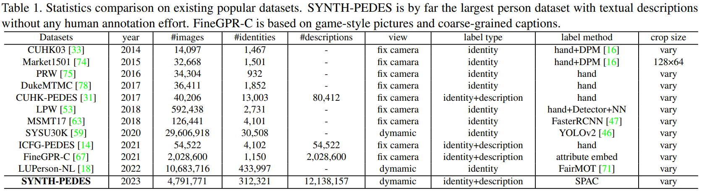

# PLIP
**PLIP** is a novel **L**anguage-**I**mage **P**re-training framework for generic **P**erson representation learning which benefits a range of downstream person-centric tasks.

Also, we present a large-scale person dataset named **SYNTH-PEDES** to verify its effectiveness, where the Stylish Pedestrian Attributes-union Captioning method **(SPAC)** is proposed to synthesize diverse textual descriptions. 

Experiments show that our model not only significantly improves existing methods on downstream tasks, but also shows great ability in the few-shot and domain generalization settings. More details can be found at our paper [PLIP: Language-Image Pre-training for Person Representation Learning](http://export.arxiv.org/abs/2305.08386).

<div align="center"></div>

## News
* 🔥[06.1] The **SYNTH-PEDES** is released. Welcome to download and use!
* 🔥[06.1] The code for **CMPM/C fine-tuning** is released! It leads to SOTA performance without bells and whistles!
* 🔥[05.31] The pre-trained model and **zero-shot inference** code are released !

## SYNTH-PEDES 
SYNTH-PEDES is by far the largest person dataset with textual descriptions without any human annotation effort. Every person image has 2 or 3 different texutal descriptions and 6 attribute annotations. The dataset is released at [Baidu Yun](https://pan.baidu.com/s/11jQ3gvkn77b3jjVx-quQxQ?pwd=1037). 

**Note that SYNTH-PEDES can only be used for research, any commercial usage is forbidden.**

This is the comparison of SYNTH-PEDES with other popular datasets.
<div align="center"></div>

These are some examples of our SYNTH-PEDES dataset.
<div align="center"></div>

Annotation format:
```
{
    "id": 7,
    "file_path": "Part1/7/1.jpg",
    "attributes": [
        "man,black hair,black shirt,pink shorts,black shoes,unknown"
    ],
    "captions": [
        "A man in his mid-twenties with short black hair is wearing a black t-shirt over light pink trousers. He is also wearing black shoes.",
        "The man with short black hair is wearing a black shirt and salmon pink shorts. He is also wearing black shoes."
    ],
    "prompt_caption": [
        "A man with black hair is wearing a black shirt with pink shorts and a pair of black shoes."
    ]
}
```

## Models
We utilize ResNet50 and Bert as our encoders. After pre-training, we fine-tune and evaluate the performance on three downstream tasks. The checkpoints have been released at [Baidu Yun](https://pan.baidu.com/s/1LjT-x6kjGwpO2EP4Ni7bCA?pwd=1037) and [Google Drive](https://drive.google.com/file/d/1Cpid6AGHXF_is5ULB3UJKMGvl6kf2Tmg/view?usp=sharing).

### CUHK-PEDES dataset (Text Re-ID R@1/R@10)
| Pre-train | CMPM/C | SSAN | LGUR | 
| :---: |:---: |:---: | :---: 
| IN sup | 54.81/83.22 |  61.37/86.73 | 64.21/87.93 
| IN unsup |55.34/83.76| 61.97/86.63| 65.33/88.47
| CLIP |55.67/83.82| 62.09/86.89| 64.70/88.76
| LUP |57.21/84.68| 63.91/88.36| 65.42/89.36
| LUP-NL |57.35/84.77| 63.71/87.46| 64.68/88.69
| **PLIP(ours)** |**69.23/91.16**| **64.91/88.39**| **67.22/89.49**

### ICFG-PEDES dataset (Text Re-ID R@1/R@10)
| Pre-train | CMPM/C | SSAN | LGUR | 
| :---: |:---: |:---: | :---: 
| IN sup | 47.61/75.48| 54.23/79.53| 57.42/81.45
| IN unsup |48.34/75.66| 55.27/79.64| 59.90/82.94
| CLIP |48.12/75.51| 53.58/78.96| 58.35/82.02
| LUP |50.12/76.23| 56.51/80.41| 60.33/83.06
| LUP-NL |49.64/76.15| 55.59/79.78| 60.25/82.84
| **PLIP(ours)** |**64.25/86.32**| **60.12/82.84**| **62.27/83.96**

### Market1501 & DukeMTMC (Image Re-ID mAP/cmc1)
| Methods | Market1501 | DukeMTMC | 
| :---: |:---: |:---: 
| BOT | 85.9/94.5 |76.4/86.4
| BDB |86.7/95.3| 76.0/89.0
| MGN |87.5/95.1 |79.4/89.0
| ABDNet |88.3/95.6| 78.6/89.0
| **PLIP+BOT** | 88.0/95.1| 77.0/86.5
| **PLIP+BDB** |88.4/95.7| 78.2/89.8
| **PLIP+MGN** |90.6/96.3| **81.7**/90.3
| **PLIP+ABDNet**|**91.2**/**96.7** |81.6/**90.9**

### Evaluate on PETA & PA-100K & RAP (PAR mA/F1)
| Methods | PETA | PA-100K | RAP
| :---: |:---: |:---: |:---: 
| DeepMAR | 80.14/83.56| 78.28/84.32| 76.81/78.94
| Rethink |83.96/86.35 |80.21/87.40 |79.27/79.95
| VTB |84.12/86.63| 81.02/87.31| 81.43/80.63
| Label2Label |84.08/86.57 |82.24/87.08| 81.82/80.93
| **PLIP+DeepMAR** | 82.46/85.87 |80.33/87.24 |78.96/80.12
| **PLIP+Rethink**|85.56/87.63| 82.09/88.12| 81.87/81.53
| **PLIP+VTB** |86.03/**88.14**| 83.24/88.57 |83.64/**81.78**
| **PLIP+Label2Label** |**86.12**/88.08 |**84.36**/**88.63**| **83.77**/81.49


## Usage
### Install Requirements
we use 4 RTX3090 24G GPU for training and evaluation.

Create conda environment.
```
conda create --name PLIP --file requirements.txt
conda activate PLIP
```

### Datasets Prepare
Download the CUHK-PEDES dataset from [here](https://github.com/ShuangLI59/Person-Search-with-Natural-Language-Description) and ICFG-PEDES dataset from [here](https://github.com/zifyloo/SSAN).

Organize them in `data` folder as follows:
```
|-- data/
|   |-- <CUHK-PEDES>/
|       |-- imgs
|            |-- cam_a
|            |-- cam_b
|            |-- ...
|       |-- reid_raw.json
|
|   |-- <ICFG-PEDES>/
|       |-- imgs
|            |-- test
|            |-- train 
|       |-- ICFG_PEDES.json
|
|   |-- <SYNTH-PEDES>/
|       |-- Part1
|       |-- ...
|       |-- Part11
|       |-- synthpedes_dataset.json
```

### Zero-shot Inference
Our pre-trained model can directly be transfered to downstream tasks, especially text-based Re-ID.

1. Run the python file and generate train/test/valid json files respectively.
```
python dataset_split.py
```

2. Then you can evaluate by running:
```
python zs_inference.py
```

### Fine-tuning Inference
Almost all existing downstream person-centric methods can be improved through replacing the backbone with our pre-trained model. Taking CMPM/C as example:

1. Go to the CMPM/C root:
```
cd Downstreams/CMPM-C
```

2. Run the following to train and test. Note that you can modify the code yourself for single GPU training:
```
python dataset_split.py 
CUDA_VISIBLE_DEVICES=0,1,2,3 python -m torch.distributed.launch --nproc_per_node=4 train.py
python test.py
```


### Evaluate on Other Methods and Tasks.
By simply replacing the visual backbone with our pre-trained model, almost all existing methods on downstream tasks make significant improvements. For example, you can try by the following repositories:

**Text-based Re-ID:**
[SSAN](https://github.com/zifyloo/SSAN), [LGUR](https://github.com/ZhiyinShao-H/LGUR)

**Image-based Re-ID:**
[BOT](https://github.com/michuanhaohao/reid-strong-baseline), [MGN](https://github.com/seathiefwang/MGN-pytorch), [ABD-Net](https://github.com/VITA-Group/ABD-Net)

**Person Attribute Recognition:**
[Rethink](https://github.com/valencebond/Rethinking_of_PAR), [Label2label](https://github.com/Li-Wanhua/Label2Label/tree/main/Pedestrian_Attribute), [VTB](https://github.com/cxh0519/VTB)

## Reference
If you use PLIP in your research, please cite it by the following BibTeX entry:
```
@misc{zuo2023plip,
    title={PLIP: Language-Image Pre-training for Person Representation Learning},
    author={Jialong Zuo and Changqian Yu and Nong Sang and Changxin Gao},
    year={2023},
    eprint={2305.08386},
    archivePrefix={arXiv},
    primaryClass={cs.CV}
}
